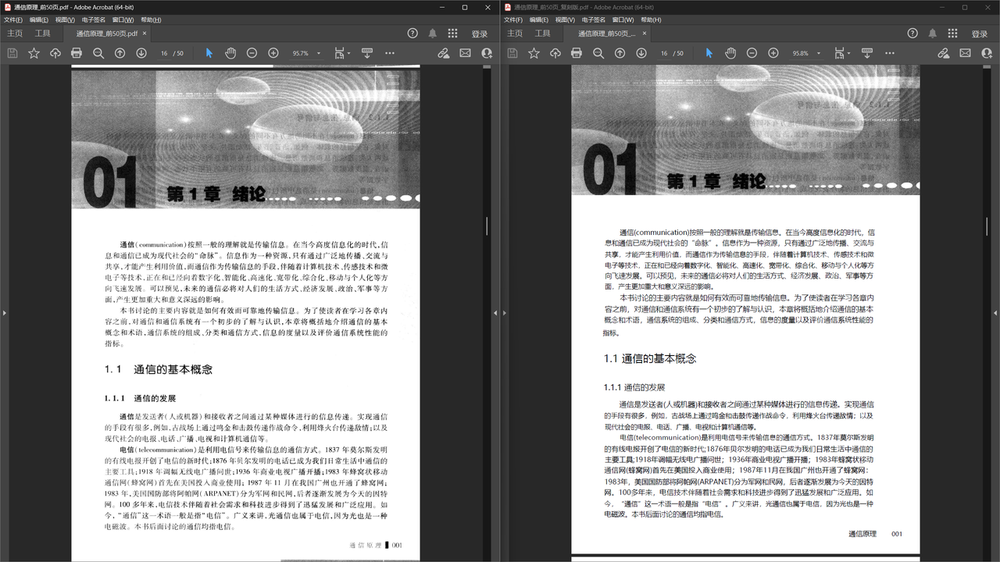
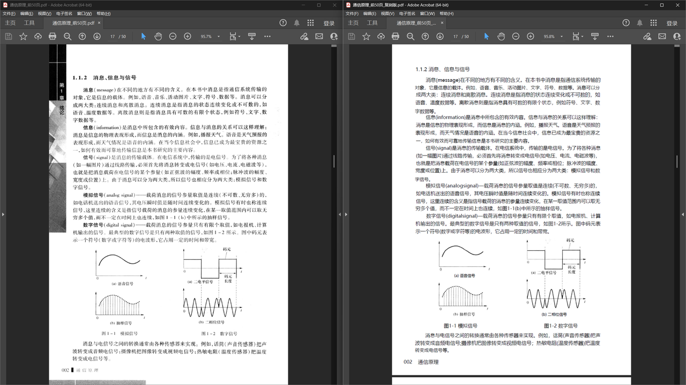

# 扫描版 PDF 排版复刻工具

将扫描版 PDF 通过 MinerU OCR 解析，复刻为可搜索、可选中的矢量 PDF。

## 原理

```
扫描PDF → MinerU OCR → middle.json → 公式LaTeX编译 + 文本渲染 + 图片放置 → 矢量PDF
```

- 公式：LaTeX 编译为矢量 PDF（Asana-Math 字体），pypdf 合并
- 文本：reportlab 直接绘制（Microsoft YaHei），block 级众数统一字号
- 图片/表格：直接嵌入 MinerU 提取的图片
- 标题/页眉/页脚/页码：reportlab 绘制
- 公式序号：提取 `\tag{}` 后作为文本绘制在页面右侧
- 中文公式：自动用 `\mbox{}` 包裹中文，xeCJK 渲染

## 效果展示




## 环境要求

| 组件 | 版本 | 说明 |
|------|------|------|
| Python | 3.12 | Windows 不支持 3.13（ray 依赖） |
| MinerU | ≥3.4.0 | OCR 解析引擎 |
| MiKTeX | 最新 | LaTeX 编译（xelatex） |
| PyTorch | CUDA 版 | GPU 加速推理 |
| GPU | ≥4GB 显存 | RTX 4060 Laptop 测试通过 |

## 安装

```bash
# 1. 创建 Python 3.12 环境
conda create -n py312 python=3.12 -y
conda activate py312

# 2. 安装 MinerU
pip install -U "mineru[all]"

# 3. 安装 CUDA PyTorch（必须！mineru[all] 默认装 CPU 版）
pip install --force-reinstall torch torchvision torchaudio --index-url https://download.pytorch.org/whl/cu128

# 4. 下载 MinerU 模型
mineru-models-download -s modelscope -m pipeline

# 5. 安装 MiKTeX + Asana-Math 字体
winget install MiKTeX.MiKTeX --accept-package-agreements --accept-source-agreements
mpm --install asana-math

# 6. 安装 Python 依赖
pip install reportlab pypdf
```

## 使用

```bash
# 用 py312 环境运行（必须指定完整路径，避免 PATH 指向其他 Python）
PY312=C:\Users\29595\Miniconda3\envs\py312\python.exe

# 处理单个 PDF（推荐用 v2 脚本）
$PY312 scripts\reconstruct_v2.py <输入PDF路径>

# 处理含中文公式的 PDF（需设置环境变量）
$env:MINERU_FORMULA_CH_SUPPORT='true'
$PY312 scripts\reconstruct_v2.py <输入PDF路径>

# 指定输出目录
$PY312 scripts\reconstruct_v2.py <输入PDF路径> --output-dir <输出目录>
```

输出自动命名，重复运行追加 `_v2`, `_v3` 后缀。

## 参数

| 参数 | 说明 | 默认值 |
|------|------|--------|
| `input_pdf` | 输入 PDF 路径（必填） | - |
| `--output-dir` | 输出目录 | `output/<pdf名>/` |
| `--config` | 字体配置 JSON | `config/font_classes.json` |
| `--project-dir` | 项目根目录 | 脚本上级目录 |
| `--debug` | 启用调试输出 | 默认开启 |

## 处理流程

```
[1/3] MinerU OCR 解析（~5秒/页，GPU）
      ↓ 输出 middle.json + 图片
[2/3] 数据收集 + 公式批量编译（~10-30秒）
      ↓ preview 包，每公式一页，按页裁剪
      ↓ 中文公式自动 \mbox{} 包裹
[3/3] 页面构建 + 公式合并（~2-25秒）
      ↓ reportlab 画文本/网格 + pypdf 合并公式
      ↓ 公式序号 \tag{} 提取后绘制在页面右侧
输出: <pdf名>_复刻版.pdf
```

## 已处理的 block 类型

| 类型 | 说明 |
|------|------|
| text | 正文段落（block 级众数统一字号） |
| inline_equation | 行内公式（clean_latex 清理后编译） |
| interline_equation | 独立公式（array 环境自动拆行，支持 `\tag{}` 序号） |
| image | 图片 |
| chart | 图表（同 image） |
| table | 表格（用 MinerU 截图渲染） |
| title | 标题（level 1 粗体，level 2 常规） |
| header | 页眉 |
| page_number | 页码 |
| footer | 页脚 |
| index | 目录/索引条目 |

## 项目结构

```
├── config/
│   └── font_classes.json   # 字体分类配置（area/char 方法）
├── docs/
│   └── 踩坑记录.md         # 环境配置 + 排版复刻踩坑
├── scripts/
│   ├── reconstruct.py      # 主脚本 v1
│   ├── reconstruct_v2.py   # 主脚本 v2（重构版，推荐）
│   ├── fonts.py            # 字体管理模块
│   ├── latex_compiler.py   # LaTeX 公式编译模块
│   └── page_builder.py     # 页面构建模块
├── output/                 # 输出目录（自动创建）
│   └── <pdf名>/
│       └── <pdf名>/ocr/
│           ├── *_middle.json    # MinerU 结构化数据
│           ├── *_layout.pdf     # 布局可视化
│           ├── images/          # 提取的图片
│           ├── _batch_formulas/ # 编译的公式 PDF
│           └── *_复刻版.pdf     # 最终输出
└── README.md
```

## 关键配置

- `SHRINK = 0.88`：整体缩小因子，避免文字溢出
- `SHRINK_SHORT = 0.75`：短文本（1-2字）缩小因子
- `TEXT_TOLERANCE = 1.0`：文本 category 匹配容差
- `REF_FONT_PT = 12.0`：公式编译参考字号
- 字号统一：block 级众数（而非行级最小值）
- 公式缩放：高度比 `th/fh × SHRINK`，宽度溢出时二次缩小
- 中文公式：`\mbox{}` 包裹，xeCJK 渲染
- 图片压缩：嵌入前 PIL 缩放到 1024px，quality=75
- 页面压缩：reportlab `setPageCompression(1)`
- 公式去重：qpdf `--replace-input` 压缩重复资源

## 环境变量

| 变量 | 说明 | 默认值 |
|------|------|--------|
| `MINERU_FORMULA_CH_SUPPORT` | 启用中文公式解析（实验性） | `false` |
| `MINERU_DEVICE_MODE` | MinerU 推理设备 | `cuda` |

## 已知限制

- 仅处理图片+公式+文本+标题+表格+页眉页脚，长文本段落待优化
- 多行 array 公式拆行后每行独立编译，列对齐可能与原版不同
- 表格用 MinerU 截图渲染，非矢量
- 约 5% 公式因 LaTeX 语法问题编译失败

## 参考

- [MinerU](https://github.com/opendatalab/MinerU) - OCR 解析引擎
- [Asana-Math](https://ctan.org/pkg/asana-math) - 公式字体
- [MiKTeX](https://miktex.org/) - LaTeX 发行版
